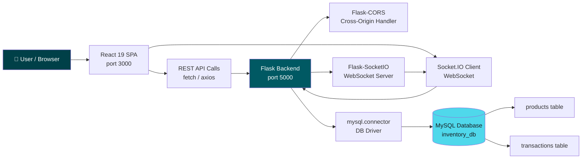
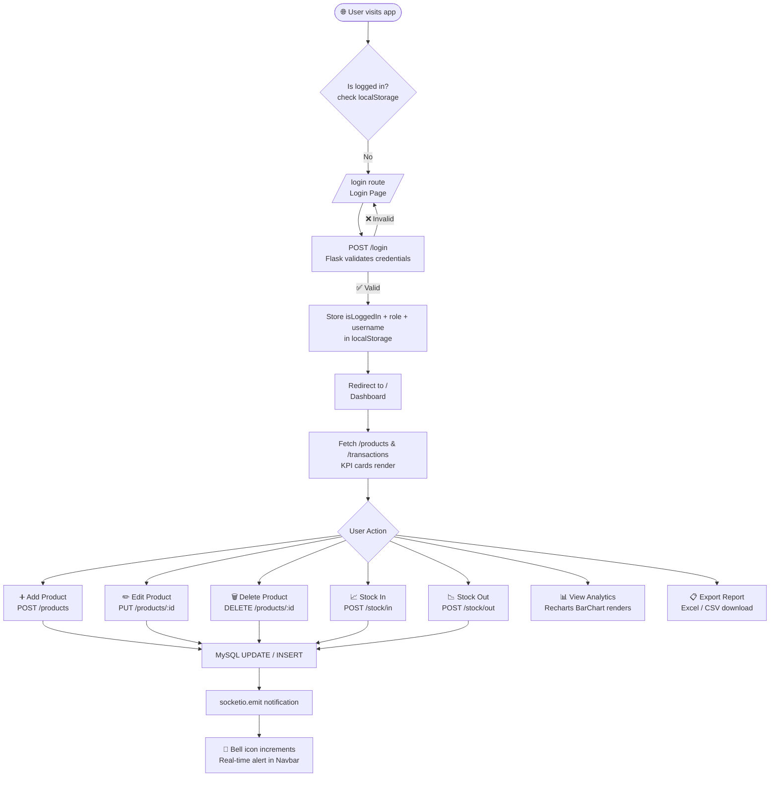

# 📦 Inventory Management System

<p align="center">
  
  
  
  
  
  
  
</p>

> A full-stack, real-time inventory management platform built with **React 19**, **Flask**, and **MySQL** — featuring live WebSocket notifications, animated UI with the "Architectural Ledger" design system, protected routing, and one-click Excel/CSV report exports.

---

## 🏗️ System Architecture



---

## 🔄 Core Feature Flow



---

## ✅ Implemented Features

### 🔐 Authentication

| Feature | Details |
|---|---|
| Admin Login | Email + password form POST to `/login`, validated server-side |
| Session Persistence | Login state stored in `localStorage` (`isLoggedIn`, `role`, `username`) |
| Protected Routes | `ProtectedRoute` component redirects unauthenticated users to `/login` |
| Role-Based Access | `allowedRoles` prop on `ProtectedRoute` restricts routes by user role |
| Logout | Clears all `localStorage` keys and redirects to `/login` |
| Demo Credentials | `admin@inventory.com` / `1234` (hardcoded in Flask for demo purposes) |

---

### 📦 Product Management

| Feature | Details |
|---|---|
| List All Products | Fetches all rows from `products` table ordered by `id DESC` |
| Add Product | Modal form — captures name, quantity, category, supplier, unit, min_stock, current_stock |
| Edit Product | Inline edit modal pre-filled with existing values |
| Delete Product | Confirmation prompt → `DELETE /products/:id` |
| Low Stock Detection | Client-side filter: any product with `quantity < 10` is flagged |
| Real-time Add/Delete Alerts | Server emits a `notification` Socket.IO event on every mutation |

---

### 🏭 Stock Operations

| Feature | Details |
|---|---|
| Stock In | Increments product quantity via `UPDATE … SET quantity = quantity + ?` |
| Stock Out | Decrements quantity with an implicit guard `WHERE quantity >= ?` |
| Transaction Logging | Every stock movement inserts a row into the `transactions` table (`IN` / `OUT`) |
| Real-time Notification | Socket.IO broadcast on every stock change |

---

### 📊 Analytics & Reports

| Feature | Details |
|---|---|
| Analytics Chart | Recharts `BarChart` renders product quantities as an interactive bar graph |
| Reports Dashboard | 4-card KPI summary: Total Products, Total Stock, Stock IN, Stock OUT |
| Low Stock Report | Highlighted list of all products below the threshold (< 10 units) |
| Transaction History | Full scrollable table of all stock movements with timestamps |
| Export to Excel | `xlsx` + `file-saver` generate a `.xlsx` workbook with one click |
| Export to CSV | Same pipeline outputs a `.csv` file of all transactions |
| Date Range Display | Computed from the earliest and latest `created_at` transaction timestamps |

---

### 🔔 Real-time Notifications

| Feature | Details |
|---|---|
| WebSocket Connection | `socket.io-client` connects to Flask-SocketIO at app load |
| Bell Icon Badge | Unread count badge auto-increments on new events |
| Notification Dropdown | Glassmorphism dropdown panel lists all session notifications |
| Auto-dismiss | Panel closes on outside click or mouse leave; clears notification list |
| Events Emitted | `New Product Added`, `Product Deleted`, `Stock IN`, `Stock OUT` |

---

### 🎨 UI / UX

| Feature | Details |
|---|---|
| Design System | "Architectural Ledger" — custom Tailwind 3.4 token palette (`surface`, `on-surface`, `primary`, `error-container`, etc.) |
| Typography | `Manrope` (display / headings) + `Inter` (body) from Google Fonts |
| Framer Motion | Page entry animations (`opacity`, `y` transitions), staggered list items, spring-physics modals |
| AnimatePresence | Smooth mount/unmount animations on modals and notification dropdown |
| Glassmorphism | `backdrop-blur-xl` + semi-transparent backgrounds on modal overlays |
| Responsive Layout | Sidebar + Navbar shell via `MainLayout`; content area uses CSS Grid / Flexbox |
| Hover Micro-animations | `whileHover={{ y: -4 }}` lift on KPI cards; opacity transitions on action buttons |
| Active Route Highlight | Sidebar link gets `border-l-2 border-primary + shadow-ambient` for the active route |

---

## 🛠️ Tech Stack

| Layer | Technologies |
|---|---|
| **Frontend Framework** | React 19, React Router DOM v7 |
| **Styling** | Tailwind CSS 3.4 (custom design tokens), PostCSS, Autoprefixer |
| **Animation** | Framer Motion 12 |
| **Charts** | Recharts 3 |
| **HTTP Client** | Native `fetch` API + Axios (service layer) |
| **WebSockets** | Socket.IO Client 4.x |
| **Report Export** | SheetJS (`xlsx`) + FileSaver.js |
| **Backend Framework** | Flask (Python) |
| **WebSocket Server** | Flask-SocketIO |
| **CORS** | Flask-CORS |
| **Database Driver** | `mysql-connector-python` |
| **Database** | MySQL 8.x (`inventory_db`) |
| **Runtime** | Node.js (React dev server via `react-scripts`) + Python 3.x (Flask) |

---

## 📄 Pages & UI

| Page | File | Route | Purpose |
|---|---|---|---|
| Login | `Login.js` | `/login` | Animated auth form; stores session in `localStorage` |
| Dashboard | `Dashboard.js` | `/` | KPI summary cards (Total Products, Low Stock, Today's Transactions) + Low Stock alert list |
| Products | `Products.js` | `/products` | Full CRUD list with Add / Edit / Delete via animated modal |
| Stock Management | `Stock.js` | `/stock` | Per-product Stock In / Stock Out controls with live quantity display |
| Analytics | `Analytics.js` | `/analytics` | Interactive Recharts BarChart of product quantities |
| Reports | `Reports.js` | `/reports` | 4-KPI grid, low stock list, transaction table, Excel export |
| Transactions | `Transactions.js` | `/transactions` | Full transaction ledger with KPIs, date range, CSV + Excel export |
| Profile | `Profile.js` | `/profile` | Displays logged-in user name, email, and role from `localStorage` |
| About | `About.js` | `/about` | Static project description page |
| Contact | `Contact.js` | `/contact` | Contact information page |

---

## 📡 API Reference

### 🔐 Authentication

| Method | Endpoint | Description | Auth Required |
|---|---|---|---|
| `POST` | `/login` | Validate email + password; returns role and name | No |

### 📦 Products

| Method | Endpoint | Description | Auth Required |
|---|---|---|---|
| `GET` | `/products` | Retrieve all products ordered by `id DESC` | No |
| `POST` | `/products` | Create a new product (name, quantity, category, supplier, unit, min_stock, current_stock) | No |
| `PUT` | `/products/<id>` | Update product name, quantity, and current_stock by ID | No |
| `DELETE` | `/products/<id>` | Remove a product by ID; emits Socket.IO notification | No |

### 🏭 Stock Operations

| Method | Endpoint | Description | Auth Required |
|---|---|---|---|
| `POST` | `/stock/in` | Add quantity to a product; logs `IN` transaction | No |
| `POST` | `/stock/out` | Remove quantity from a product (guarded by stock level); logs `OUT` transaction | No |

### 💸 Transactions

| Method | Endpoint | Description | Auth Required |
|---|---|---|---|
| `GET` | `/transactions` | Retrieve all transaction records ordered by `created_at DESC` | No |

### 📊 Dashboard

| Method | Endpoint | Description | Auth Required |
|---|---|---|---|
| `GET` | `/dashboard` | Returns `total` products count, `low` stock count (qty < 10), and `today` (static 0) | No |

> **Note:** The current API does not implement JWT/token-based authentication middleware. The `ProtectedRoute` guard runs entirely client-side. All endpoints are technically accessible without authentication. Implementing server-side token validation is a recommended next step.

---

## ⚡ Quick Start

### Prerequisites

- **Python** 3.8+ with `pip`
- **Node.js** 18+ with `npm`
- **MySQL** 8.x running locally

### Steps

1. **Clone the repository**
   ```bash
   git clone https://github.com/mohak1206/inventory.git
   cd inventory
   ```

2. **Set up the MySQL database**
   ```sql
   CREATE DATABASE inventory_db;
   USE inventory_db;

   CREATE TABLE products (
     id            INT AUTO_INCREMENT PRIMARY KEY,
     name          VARCHAR(255) NOT NULL,
     category      VARCHAR(100),
     supplier      VARCHAR(100),
     unit          VARCHAR(50),
     min_stock     INT DEFAULT 0,
     current_stock INT DEFAULT 0,
     quantity      INT DEFAULT 0
   );

   CREATE TABLE transactions (
     id         INT AUTO_INCREMENT PRIMARY KEY,
     product_id INT NOT NULL,
     type       ENUM('IN', 'OUT') NOT NULL,
     quantity   INT NOT NULL,
     created_at DATETIME DEFAULT CURRENT_TIMESTAMP
   );
   ```

3. **Configure the backend** *(see Environment Variables below)*
   ```bash
   cd backend
   # Update DB credentials directly in app.py (or use a .env file — see Security Guide)
   ```

4. **Install backend dependencies**
   ```bash
   cd backend
   pip install flask flask-cors flask-socketio mysql-connector-python
   ```

5. **Start the Flask backend**
   ```bash
   cd backend
   python app.py
   # Server starts at http://127.0.0.1:5000
   ```

6. **Install frontend dependencies**
   ```bash
   cd frontend
   npm install
   ```

7. **Start the React dev server**
   ```bash
   npm start
   # App opens at http://localhost:3000
   ```

8. **Login with the demo account**
   ```
   Email:    admin@inventory.com
   Password: 1234
   ```

---

## 🌍 Environment Variables

> **Note:** The current version stores database credentials directly in `backend/app.py`. For production deployments, these **must** be moved to environment variables using `python-dotenv` or a secrets manager.

| Variable | Required | Description |
|---|---|---|
| `DB_HOST` | ✅ Yes | MySQL host (default: `localhost`) |
| `DB_USER` | ✅ Yes | MySQL username (default: `root`) |
| `DB_PASSWORD` | ✅ Yes | MySQL password |
| `DB_NAME` | ✅ Yes | MySQL database name (default: `inventory_db`) |
| `FLASK_DEBUG` | ⚠️ Dev only | Set to `True` for hot-reload; **must be `False` in production** |
| `SECRET_KEY` | ✅ Yes (prod) | Flask secret key for session signing (not yet used, recommended for JWT) |

**Example `.env` file (backend):**
```env
DB_HOST=localhost
DB_USER=root
DB_PASSWORD=your_secure_password
DB_NAME=inventory_db
FLASK_DEBUG=False
SECRET_KEY=change_me_to_a_random_string
```

---

## 📁 Repository Structure

```
Inventory/
├── backend/
│   ├── app.py                      # Flask REST API + Socket.IO server (all routes & logic)
│   ├── requirements.txt            # Python dependencies
│   ├── .env.example                # Environment variable template
│   └── uploads/                    # File uploads directory
│
├── docs/                           # Documentation files (reserved)
│
├── frontend/
│   ├── public/
│   │   ├── favicon.ico
│   │   ├── index.html              # App HTML entry point
│   │   ├── logo192.png
│   │   ├── logo512.png
│   │   ├── manifest.json
│   │   └── robots.txt
│   └── src/
│       ├── components/
│       │   ├── auth/
│       │   │   └── Login.js            # Animated auth form
│       │   ├── common/
│       │   │   ├── Navbar.js           # Top bar: title, notifications bell, user dropdown
│       │   │   ├── ProtectedRoute.js   # Route guard — redirects unauthenticated users
│       │   │   └── Sidebar.js          # Navigation links with active-route highlighting
│       │   └── pages/
│       │       ├── About.js            # Static about page
│       │       ├── AddProductModal.js  # Reusable add-product modal (standalone)
│       │       ├── Analytics.js        # Recharts BarChart of product quantities
│       │       ├── Contact.js          # Static contact page
│       │       ├── Dashboard.js        # KPI summary cards + low-stock alert list
│       │       ├── Notifications.js    # Socket.IO listener + glassmorphism dropdown
│       │       ├── Products.js         # Full CRUD list with spring-physics modal
│       │       ├── Profile.js          # Logged-in user info from localStorage
│       │       ├── Reports.js          # 4-KPI summary, low-stock list, Excel export
│       │       ├── Stock.js            # Per-product Stock In / Stock Out controls
│       │       └── Transactions.js     # Full transaction ledger + CSV / Excel export
│       ├── layout/
│       │   └── MainLayout.js       # App shell: Sidebar + Navbar + page content
│       ├── services/
│       │   └── api.js              # Axios instance with base URL + token interceptor
│       ├── App.js                  # BrowserRouter, Routes, ProtectedRoute wiring
│       ├── index.css               # Global styles + Tailwind CSS directives
│       └── index.js                # React 19 DOM root render
│
├── venv/                           # Python virtual environment (excluded from git)
├── .gitignore
├── package.json                    # Node dependencies and npm scripts
├── package-lock.json
├── postcss.config.js               # PostCSS + Autoprefixer configuration
├── tailwind.config.js              # Architectural Ledger design token definitions
└── README.md                       # Project documentation (this file)
```

---

## 🔒 Security Guide

> ⚠️ **Critical: Review before deploying to any non-local environment.**

### Current Security Posture (Development)

| Issue | Location | Risk | Recommended Fix |
|---|---|---|---|
| Hardcoded DB password | `backend/app.py` line 16 | 🔴 Critical | Move to `.env` + `python-dotenv` |
| Hardcoded admin credentials | `backend/app.py` line 211 | 🔴 Critical | Store hashed passwords in DB (`bcrypt`) |
| No server-side auth middleware | All API routes | 🟠 High | Implement JWT tokens with `flask-jwt-extended` |
| Client-side only route guard | `ProtectedRoute.js` | 🟠 High | API must validate tokens on every protected endpoint |
| `FLASK_DEBUG=True` in production | `app.py` line 223 | 🟠 High | Set `debug=False` and use a WSGI server (Gunicorn) |
| `CORS(app)` allows all origins | `app.py` line 7 | 🟡 Medium | Restrict to your frontend domain in production |

### `.gitignore` Recommendations

Ensure these are never committed:
```gitignore
venv/
*.pyc
__pycache__/
.env
node_modules/
build/
```

---

## 📜 License

This project is licensed under the **MIT License**. You are free to use, modify, and distribute this software for personal or commercial purposes.

---

## 💡 Why This Project Matters

This Inventory Management System is more than a CRUD app — it is a **production-architecture reference implementation** that demonstrates a mature, well-layered engineering approach. The project showcases bidirectional real-time communication via **Flask-SocketIO** with a React client that reacts to server-pushed events without polling. The frontend is built on a bespoke **Tailwind design system** ("Architectural Ledger") with custom color tokens, typography pairings (Manrope + Inter), and an elevation model — skills that go far beyond template-driven UI work. **Framer Motion** is used idiomatically with `AnimatePresence`, spring physics, and staggered list animations, reflecting a genuine understanding of declarative animation pipelines. The export pipeline — using **SheetJS** to generate real `.xlsx` workbooks in the browser — demonstrates hands-on knowledge of binary file generation in JavaScript. Routing is handled with React Router v7's latest data-router API, with a reusable `ProtectedRoute` guard that accounts for both authentication state and role-based access control. Taken together, this project reflects strong command of **full-stack JavaScript/Python development**, **real-time systems**, **UI/UX engineering**, and **database-driven application design**.
